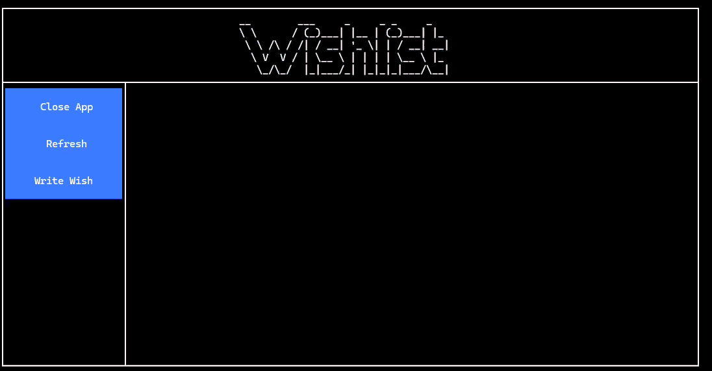

# Wishlist
Auf dieser digitalen Wunschliste können sich individuen gegenseiteig Wünsche äußern. Man äußert einen Wunsch und gleichzeitig werden alle anderen Teilnehmer über diesen Wunsch informiert.



## :star: Build from Source
```
go build -o Wishlist.exe main.go
```
## Initialisierung
```
.\Wishlist.exe --init <location>
```
## Verteilung
Nach der Initialisierung kann die .exe zusammen mit `settings.env` an die User verteilt werden. Es ist darauf zu achten, dass der Parameter `WISHLIST_USER=null` gesetzt ist.

## :+1: Starten
Nach der Verteilung kann die app durch einfaches doppelklicken gestartet werden. Es folgt eine Abfrage des Usernamens und im Anschluss kann es losgehen.

